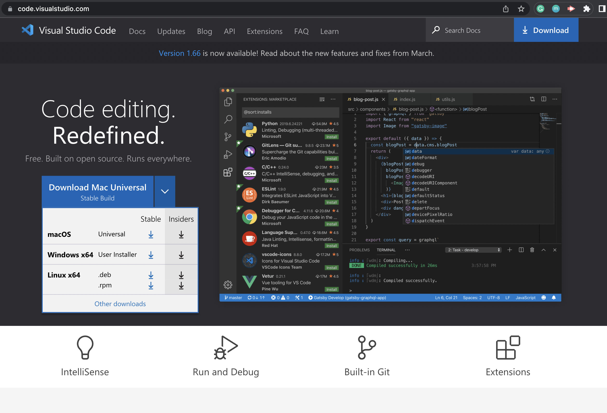
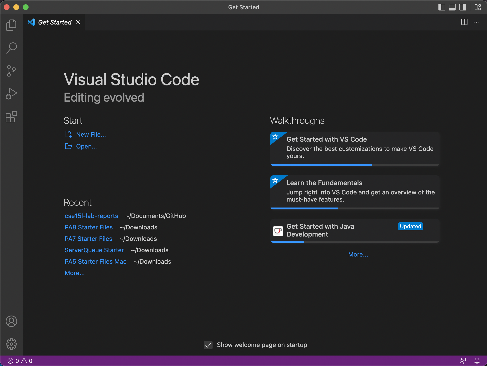
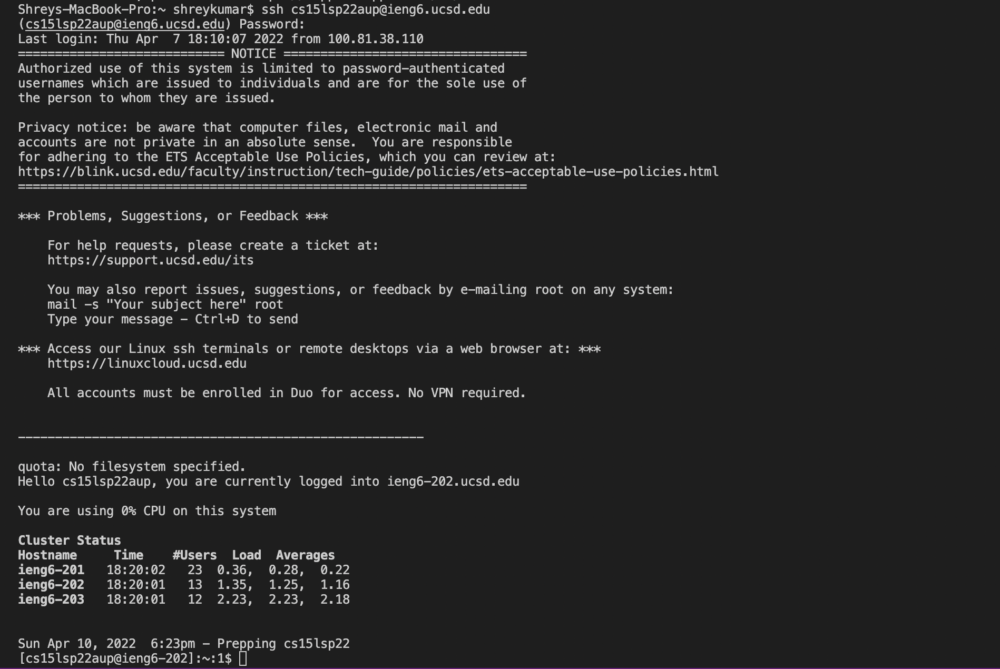
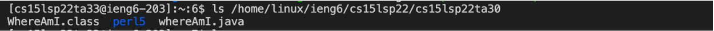
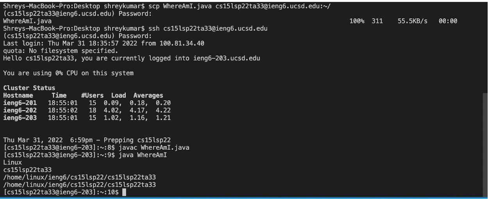
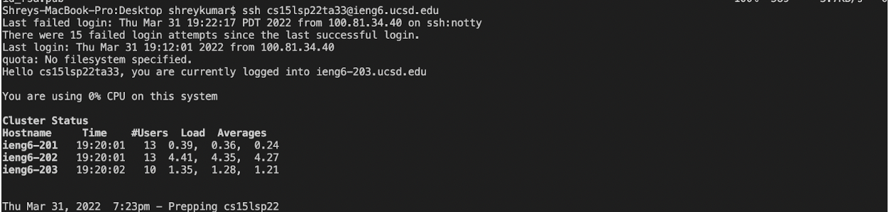
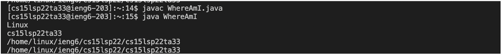

# Lab Report 1


## **Installing VScode**

1. Go to the link provided below and download the version of Visual Studio Code suitable for your personal operating system. The website should look like this:



[VSCode Installation](https://code.visualstudio.com/) 

2. When you open a window of VSCode, it will look like the following...




## **Remotely Connecting**


1. Look up your course specific account which will be needed to connect remotely later.
[Account Look Up](https://sdacs.ucsd.edu/~icc/index.php)

2. Open up a terminal in VSCode, and write in the command that will follow this structure: 
```
$ ssh cs15lsp22zz@ieng6.ucsd.edu
```
However the "zz" part of the command will be replaced by your specific course related letters found in the website above.

3. The first time you try and connect, you will be prompted with the message "Are you sure you want to continue connecting?" as the authencitiy of the host hasnt been established. Type "yes".

4. Then type your password when prompted. 
NOTE: When typing a password in the command terminal, you won't be able to see what you are typing.

5. You are now finally connected. Your terminal should look like this.




## **Commands**

There are a variety of commands you can do on the terminal. Here are a list of those commands and there functions:
```
1. cd - *change directory*
2. cd ~ - *changes to the home directory*
3. ls -a - *list hidden files and directories*
4. ls -l - *list with detailed information*
5. ls -t - *list files in a sorted order of last modificated*
6. ls <directory> - *list files in a certain directory*
```




  
## **SCP - Moving Files**


1. In this step we will be moving files from clients to remote computers. So first go to the file that you want to be moved and open the terminal.
2. Type this ```scp <file name> cs15lsp22zz@ieng6.ucsd.edu:~/``` and type your password. The file has been moved now.
3. You can remotely connect and type "ls" to see your file.


  
  
## **Setting Up SSH Key**

This is done to avoid continuously typing in your whole password. A shortcut.

1. Type ```ssh-keygen``` on your computer. You will be prompted to enter a passphrase, just hit enter. You have now created a key pair (private and public key).
2. We have to now copy the public key from the client computer to the remote one, remotely connect.
3. Make .ssh directory, ```mkdir .ssh```
4. Back on the client computer, copy the public key to the ssh directory.
```scp /Users/<user-name>/.ssh/id_rsa.pub cs15lsp22zz@ieng6.ucsd.edu:~/.ssh/authorized_keys```
5. Now you will be able to remotely connect without a password. 




## **Optimizing Remote Running**
  
1. To remotely run a lot more efficiently, we can make multiple commands on the same line. 

For Instance:

```$ ssh cs15lsp22zz@ieng6.ucsd.edu "ls" ```- *This will connect remotely and then list the files, command just run on one line*

or

$ cp WhereAmI.java OtherMain.java; javac OtherMain.java; java WhereAmI  - *Multiple commands on the same line, to run the file*


