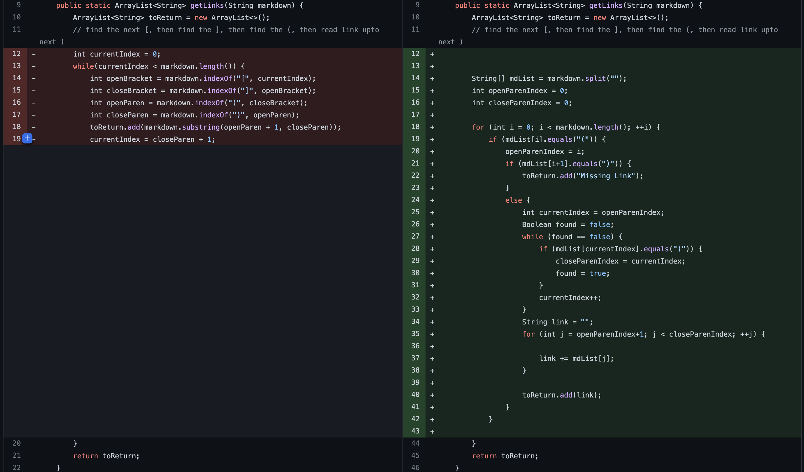
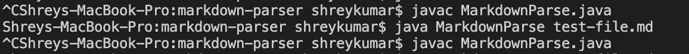
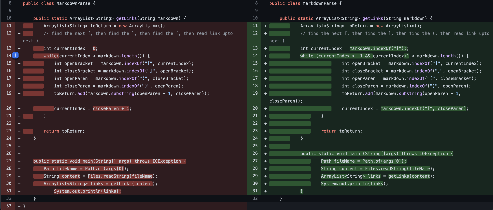
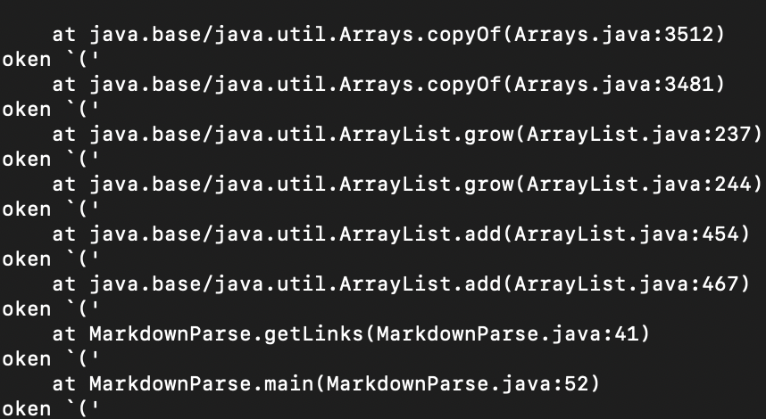
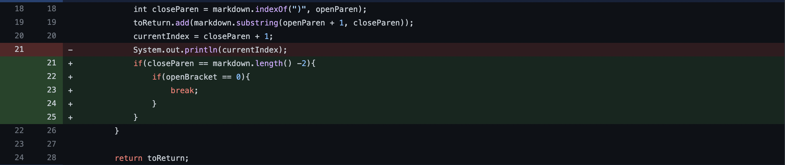

# Lab Report 2

## Code Change 1

[Link to the failure inducing input](https://github.com/shreykumar18/markdown-parser/blob/main/test-file.md) that prompted the code change.

**Sympton of Failure Inducing Input**

For the first failure inducing input we can see that the sympton which is a failure to run and provide the link is caused by the bug of not providing a link in the input. The file than cannot register a link in the markdown format and so doesn't display anything as seen in the input.

***

## Code Change 2

[Link to the failure inducing input](https://github.com/LinearParadox/markdown-parser/commit/6ffbcdace8d795b3715c463883f7716547bd52d6) that prompted the code change.

**Sympton of Failure Inducing Input**

For the second failure inducing input we have a link of an image provided instead of a URL, the sympton we see is a runtime error as the while loop running over the markdown text is trying to find a link that doesn't exist. The bug is that an image was used and not a link which causes this sympton.

***

## Code Change 3

[Link to the failure inducing input](https://github.com/a3alani/markdown-parser/commit/ea2cf261c525710e8e2385782e63c6e6f187c2dd) that prompted the code change.

**Sympton of Failure Inducing Input**

The third failure inducing input is caused by a bug wherein an additional second closing parameter has been used. This causes the sympton which cannot display the link as it is not following the markdown syntax.

