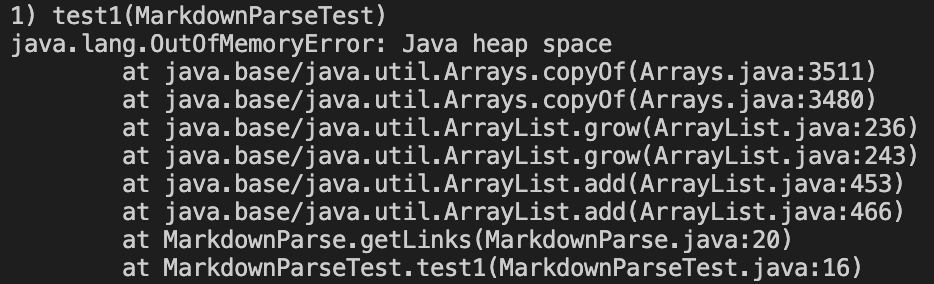
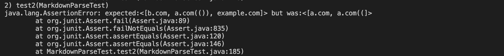

# Lab Report 2

## Links for Repositories

[My Own Repository](https://github.com/shreykumar18/markdown-parser.git)

[Reviewed Repository](https://github.com/kcyy127/markdown-parser.git)

## Test Cases

**Snippet 1**

*Expected Output*: [url.com, 'google.com, google.com, ucsd.edu]

*Created Test*

*Output of My Own Implementation*

It didn't pass.

*Output of Reviews Implementation*

It didn't pass.

**Snippet 2**

*Expected Output*: [b.com, a.com(()), example.com]

*Created Test*

*Output of My Own Implementation*

It didn't pass.

*Output of Reviews Implementation*

It didn't pass.

**Snippet 3**

*Expected Output*: [b.com, a.com(()), example.com]

*Created Test*

*Output of My Own Implementation*

It didn't pass.

*Output of Reviews Implementation*

It didn't pass.

## Change Reflections ##

*Snippet 1*, for my program I think it is possible to fix this with another series of conditions (if statements) to check if the index of certain paranthesis are in the assumed correct position, but I feel like this won't be an efficient method for everytime a new type of test case is introduced. 

*Snippet 2*, my program uses a system that is catered to be very specific for a certain type of test case, even though I think it is possible to do it under 10 lines of code by checking index placement, the code should be changed to a different type of logic in which traversing the test cases are much easier such as the code seen in the reviewed example.

*Snippet 3*, I don't believe a simply code change can be made for this type of testcase. My program is reliant on the use of index placement, and so the program should be rewritten without the system of 'looking for the next character' and instead breaking down the file maybe as a list of strings and then putting variety of conditions to check for certain character. I believe this would be more efficient as a program.

