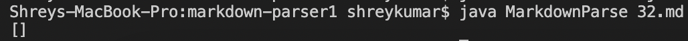
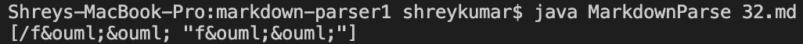
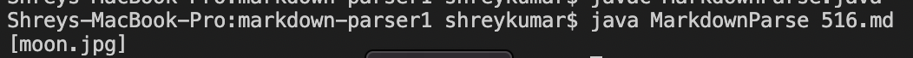
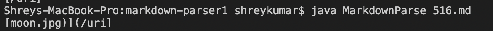

# Lab Report 5

## Process

I found the results of the tests using two different methods. The first one was using bash to run the 'script.sh' file to test all the testfiles and then manually going through some of the test cases. The second method was using 'vimdiff' to directly see whether there were any differences. 

## Link for Tests

[First Test Case #32](https://github.com/nidhidhamnani/markdown-parser/blob/main/test-files/32.md)

[Second Test Case #516](https://github.com/nidhidhamnani/markdown-parser/blob/main/test-files/516.md)

## Test 1

For test file '32.md', the correct implementation is the one that was provided in the lab as no link is provided. 

Output of correct implementation:



Output of my own implementation:



Expected Output:

```
[]
```

Solutions:

My program takes an empty space as the end of the line and so doesn't check for the case in which if there is an empty space within the line it means the URL doesn't exist. This should be added to the implementation through simple if conditions.


## Test 2

For test file '516.md', neither of the implementations were correct.

Output of given Lab 9 implementation:



Output of my own implementation:



Expected Output:

```
[/uri]
```

Solutions:

For the given implementation, the program looks for the first case of normal brackets, but since these are used in the hyperlink for the link, the wrong information is returned. It should traverse the whole line and see if there are multiple brackets being used to find the correct link. 

In my own implementation, an additional bracket wasn't taken into account. The program relies on the indexing and that is not an effective approach when dealing with multiple brackets. 

